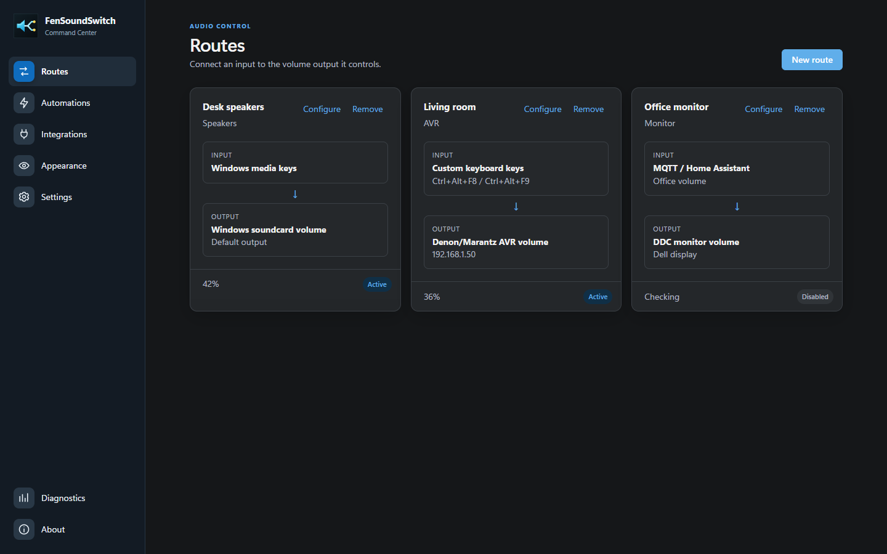

# FenSoundSwitch

## One set of volume keys. The sound you actually want.

`FenSoundSwitch` turns configured controls into a simple remote for your monitor, AV receiver, or both.

Build named routes for the rooms and devices you use. Choose a monitor or receiver for each route, then adjust them together from your keyboard. A tray-first WebView2 interface, configurable overlays, and optional Windows or Discord device switching keep control close without adding clutter. The interface is packaged locally and does not run a web server or load remote UI assets.



## Why FenSoundSwitch

- Use Windows volume keys for a monitor, receiver, or several devices at once.
- Create clearly named routes such as `Desk monitor`, `Living room`, or `Movie night`.
- Control compatible displays, Windows applications and soundcards, Bluetooth audio devices, HTTP JSON devices, and popular network receivers.
- Optionally turn a configured receiver on and select its input when its route first activates.
- Reuse named MQTT/Home Assistant broker configurations across volume routes, button-triggered automations, and raw or Home Assistant-compatible publish steps.
- See a clean Windows 11 or macOS-style volume overlay.
- Keep the app quietly available in the notification area.
- Build automations for monitor input, brightness, contrast, MQTT publishing, bounded HTTP requests, Windows power plans and audio devices, or optional Discord output switching. Run them when the app starts, from a keyboard shortcut, from a notification-area menu item, or from any combination of those triggers.
- Keep the Windows default playback and/or voice output active by rendering silence, continuously or after recent mouse movement.
- Start automatically with Windows.
- Export and restore configuration archives; protect exports because MQTT credentials are included.
- Follow the Windows language automatically or choose English, German, Spanish, French, or Italian for the command center.
- Check the exact release tag, or `dev` for source/local builds, on the About page.

## Platform Support

Windows 10 and Windows 11 support the complete current feature set, including DDC/CI monitor control, global media-volume key interception, tray operation, Windows endpoint automation, and Start with Windows.

macOS uses the local pywebview Cocoa/WebKit command center as its primary UI, with the existing Tk renderer kept hidden solely for the volume overlay. It supports the route editor, network receiver outputs, MQTT/Home Assistant routes, and configuration archives. Global shortcuts, monitor DDC control, menu-bar operation, Discord output switching, Windows endpoint automation, and Windows audio plugins are intentionally unavailable. The **Start at Login** toggle writes a current-user launchd agent.

## Get Started

1. Download `FenSoundSwitch.msi` from [GitHub Releases](https://github.com/fensoft/windows-ddc/releases) and install it.
2. Launch **FenSoundSwitch** from the Start Menu and open the window from the notification area if needed.
3. Select **New route**, give it a name and informational type, select **Windows media keys** as the input, and choose an output.
4. Configure the output, then press Volume Up or Volume Down at a safe listening level.

Pass `--foreground` when launching the executable, or run `python app.py --foreground` from source, to open the command center immediately instead of starting in the notification area.

Windows requires the [Microsoft Edge WebView2 Runtime](https://developer.microsoft.com/en-us/microsoft-edge/webview2/#download-section), which is included with current Windows installations. On macOS, install a Python distribution that includes Tk and pywebview's Cocoa/WebKit dependencies, then run `python app.py --foreground`. Compatible monitor control requires DDC/CI enabled in the monitor menu and is currently Windows-only. Receiver control requires a supported receiver on your home network.

For Homebrew Python 3.12, install its separate Tk binding before creating the virtual environment:

```zsh
brew install python@3.12 python-tk@3.12
/opt/homebrew/opt/python@3.12/bin/python3.12 -m venv .venv
.venv/bin/python -m pip install -e .
.venv/bin/python app.py --foreground
```

## Default Configuration

On first launch, FenSoundSwitch creates `%APPDATA%\fensoundswitch\configurations\default.fsc` from its bundled `default.py` definition. The **Default** button imports this ready-to-use Windows audio configuration:

- Volume Up and Volume Down control the default output route named **Output**.
- `Ctrl + Alt + F9` and `Ctrl + Alt + F10` control the default voice-output route named **Voice**.
- The Discord action is disabled.
- Audio keep-alive is enabled for both the default playback and voice outputs. It remains active while the mouse is moving and for 60 seconds afterward.

Default device automations:

- To cycle playback devices, press `Ctrl + Alt + F11`.
- To cycle recording devices, press `Ctrl + Alt + F7`.

> [!IMPORTANT]
> Once a route is ready, Volume Up and Volume Down control your configured route instead of Windows system volume. Mute is intercepted only when at least one ready routed output explicitly supports confirmed native mute; unsupported outputs, including DDC monitors, are left unchanged.

## User Documentation

- [Complete user manual](docs/MANUAL.md)
- [Troubleshooting](docs/TROUBLESHOOTING.md)
- [What changed](CHANGELOG.md)

## For Developers

- [Build instructions](BUILD.md)
- [Technical documentation](docs/TECHNICAL.md)
- [Architecture](docs/ARCHITECTURE.md)
- [Repository rules](AGENTS.md)
