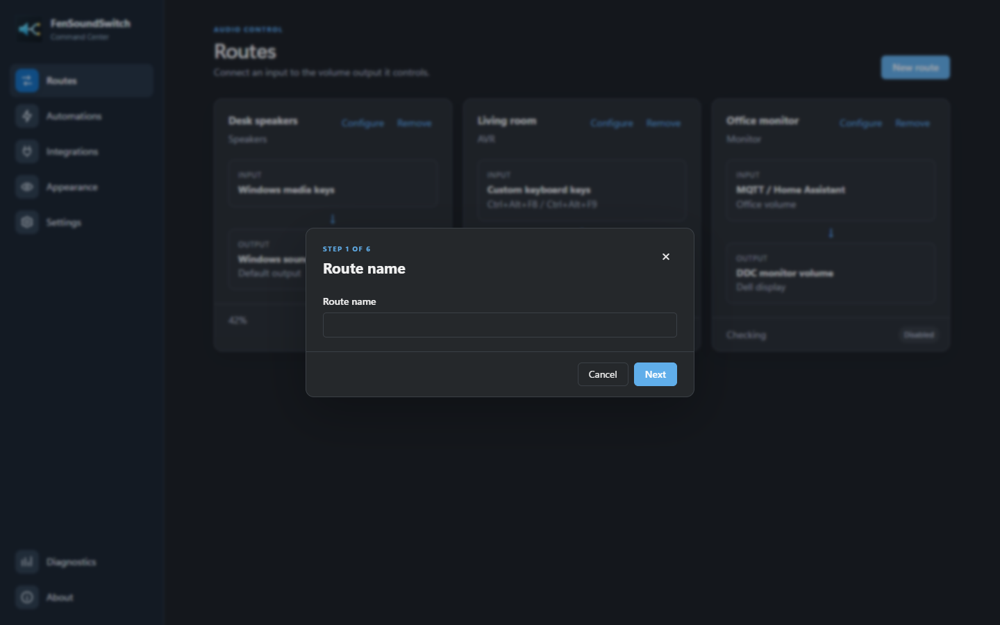
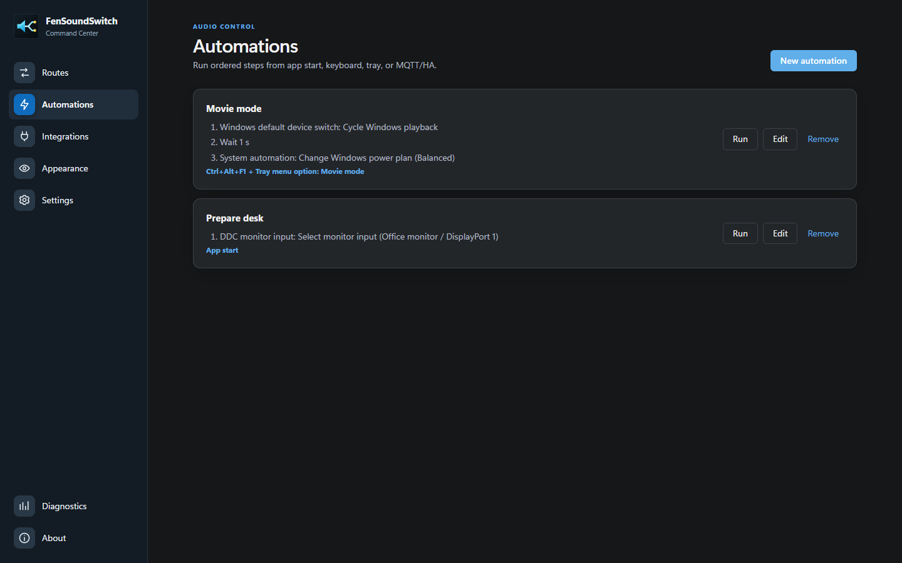
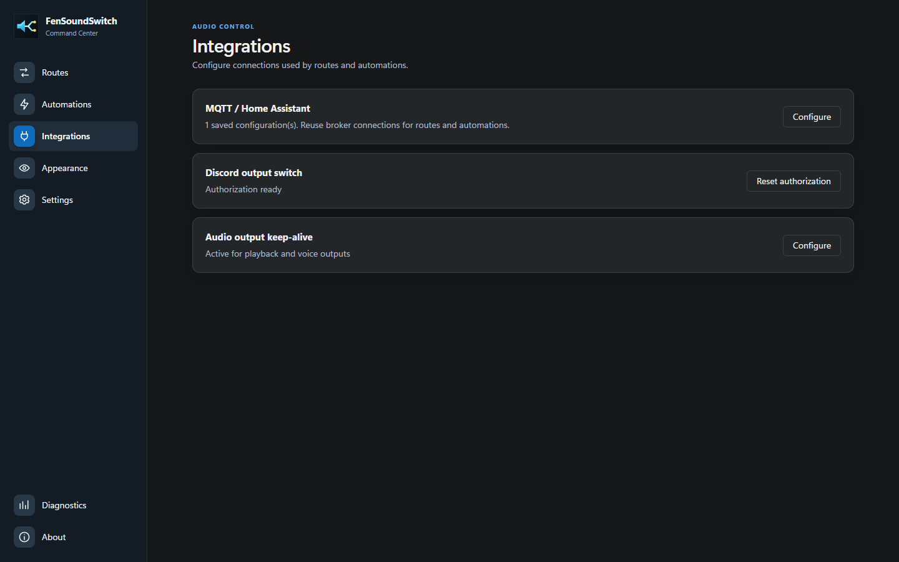
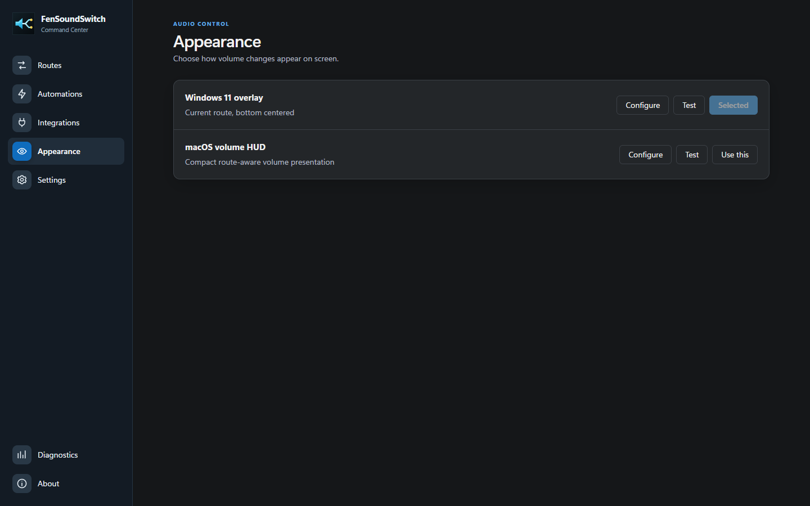
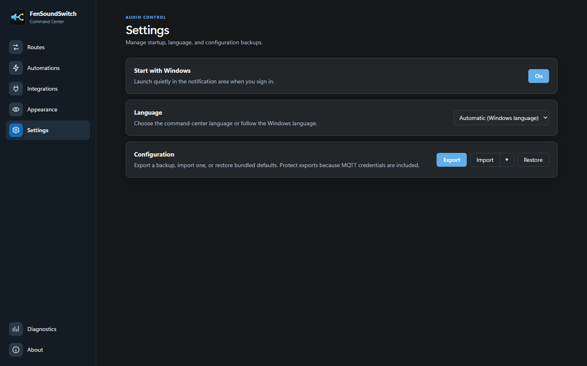
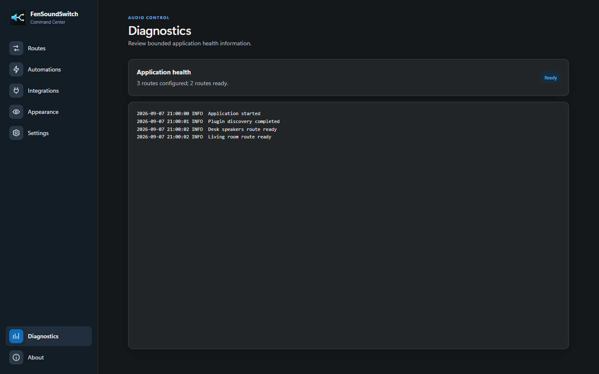

# FenSoundSwitch User Manual

FenSoundSwitch connects volume inputs, such as the Windows media keys, to the audio devices you actually want to control. It can control one device or several devices from the same input, display a route-aware volume overlay, and run ordered automations.

> [!NOTE]
> Command-center screenshots in this manual use safe example data rendered by the current packaged interface. They do not show a live machine, saved credentials, or real diagnostic records. Available controls vary by platform and by the plugins installed and enabled.

## Contents

- [Requirements and platform support](#requirements-and-platform-support)
- [Install and launch](#install-and-launch)
- [Quick start](#quick-start)
- [Understand the command center](#understand-the-command-center)
- [Create and manage routes](#create-and-manage-routes)
- [Route inputs](#route-inputs)
- [Route outputs](#route-outputs)
- [Automations](#automations)
- [Integrations](#integrations)
- [Appearance and overlays](#appearance-and-overlays)
- [Settings and backups](#settings-and-backups)
- [Notification-area operation](#notification-area-operation)
- [Keyboard and accessibility](#keyboard-and-accessibility)
- [Safety, privacy, and stored data](#safety-privacy-and-stored-data)
- [Troubleshooting](#troubleshooting)
- [Uninstall](#uninstall)

## Requirements And Platform Support

### Windows

Windows 10 and Windows 11 support the complete feature set. The command center requires Microsoft Edge WebView2 Runtime, which is included with current Windows installations.

DDC/CI monitor control also requires:

- A compatible monitor connected through a path that carries DDC/CI commands.
- DDC/CI enabled in the monitor's on-screen menu.
- A monitor that exposes the requested control, such as volume, input, brightness, or contrast.

Network receiver and HTTP features require local-network access to the configured device. MQTT features require access to a user-provided MQTT broker.

### macOS

macOS uses the local pywebview Cocoa/WebKit command center and supports route editing, network receiver outputs, MQTT/Home Assistant routes, overlays, configuration archives, and **Start at Login**.

The following features are Windows-only: global shortcuts, Windows media keys, DDC/CI monitor control, notification-area operation, Discord output switching, Windows audio outputs, Windows default-device actions, and Windows power-plan actions.

## Install And Launch

### Install On Windows

1. Download `FenSoundSwitch.msi` from [GitHub Releases](https://github.com/fensoft/windows-ddc/releases).
2. Open the installer and complete the Windows Installer prompts.
3. Launch **FenSoundSwitch** from the Start Menu.
4. If no window appears, open the notification-area overflow menu and double-click **FenSoundSwitch**.

The installed application is placed under Program Files and an all-users Start Menu shortcut is created. An ordinary launch starts quietly in the notification area. Launching the app again asks the existing instance to restore its window instead of opening a second copy.

### Run From Source

Install Python 3.10 or later, create a virtual environment, and run:

```powershell
python -m pip install -e .
python app.py --foreground
```

On Apple Silicon with Homebrew Python 3.12:

```zsh
brew install python@3.12 python-tk@3.12
/opt/homebrew/opt/python@3.12/bin/python3.12 -m venv .venv
.venv/bin/python -m pip install -e .
.venv/bin/python app.py --foreground
```

Use `app.py`, not `main.py`. The `--foreground` option opens the command center after startup instead of leaving it in the notification area.

### Check The Version

Open **About**. A release build shows its embedded release tag. Source runs and ordinary local builds show `dev`.

## Quick Start

The safest first setup is a Windows soundcard route:

1. Open **Settings** and select **Restore** if you want the bundled defaults.
2. Confirm the restart prompt.
3. Open **Routes** after the app restarts.
4. Confirm that the **Output** route uses **Windows media keys** and **Windows soundcard volume** with **Default output** selected.
5. Lower the Windows output to a safe listening level.
6. Press Volume Down or Volume Up once and confirm that the expected device changes.

The bundled default configuration creates:

| Control | Result |
| --- | --- |
| Volume Down / Volume Up | Controls the default playback route named **Output**. |
| `Ctrl+Alt+F9` / `Ctrl+Alt+F10` | Controls the default voice-output route named **Voice**. |
| `Ctrl+Alt+F11` | Cycles the Windows playback device. |
| `Ctrl+Alt+F7` | Cycles the Windows recording device. |

It also enables audio keep-alive for the default playback and voice outputs after recent pointer movement. Discord remains disabled.

> [!IMPORTANT]
> Restoring defaults replaces saved routes and plugin settings, then may restart the app. Export the current configuration first if it must be preserved.

## Understand The Command Center


The left navigation contains seven pages:

| Page | Purpose |
| --- | --- |
| **Routes** | Connect volume inputs to outputs and view each route's current state. |
| **Automations** | Combine triggers with ordered action and wait steps. |
| **Integrations** | Manage reusable MQTT connections and plugin-wide setup such as Discord and audio keep-alive. |
| **Appearance** | Select, configure, and test the volume overlay. |
| **Settings** | Manage startup, language, exports, imports, and bundled defaults. |
| **Diagnostics** | View current application health and the bounded diagnostic log. |
| **About** | View the application name and exact version. |

### Core Terms

**Route**: one input connected to one output. Create several routes with the same input to change several outputs from one key press.

**Input**: the event or command that requests a volume change, such as Windows media keys, custom keys, or MQTT.

**Output**: the device or software endpoint whose volume changes.

**Route type**: an informational label such as Speakers, AVR, or Monitor. It selects suitable macOS HUD artwork but does not change routing behavior.

**Automation**: one or more triggers connected to 1-32 ordered action or wait steps.

**Integration**: reusable or plugin-wide configuration used by routes and automations.

### Route Status

- A percentage means the output returned a confirmed volume.
- **Active** means the route is currently available for its configured input.
- **Checking** means the app is discovering or validating the output.
- **Disabled** or an unavailable reason means the route will not receive volume changes until it becomes ready.

Status is based on confirmed reads and readbacks. The app does not continuously poll for external volume changes made from another remote or an on-device control.

## Create And Manage Routes

### Create A Route

Select **New route** on the **Routes** page. The wizard has six steps.



1. **Route name**: enter a clear name, such as `Desk speakers` or `Living room`.
2. **Type**: choose Voice, Headset, Headphones, Earbuds, Speakers, Soundbar, TV, AVR, Amplifier, Microphone, Line-in, Line-out, Mixer, Monitor, or Other.
3. **Input plugin**: choose how the route receives volume commands.
4. **Input configuration**: assign keys or MQTT details when the selected input requires them.
5. **Output plugin**: choose the device or service to control.
6. **Output configuration**: select a device or enter connection details, then select **Create route**.

Test the route at a safe level immediately after creating it.

### Control Several Outputs Together

Create one route per output and assign the same input to each. For example, two routes can both use **Windows media keys**, with one controlling a monitor and the other controlling an AVR. Each accepted key press changes the ready outputs in sequence.

One unavailable route does not authorize unsafe fallback to a different device. Check each card to confirm which routes are active.

### Edit Or Remove A Route

- **Configure** changes the route name, type, input, output, and endpoint-specific settings.
- **Remove** permanently deletes the route after confirmation.
- Removing or reconfiguring a route releases its registered custom keys.
- Route and endpoint changes take effect without importing a configuration archive.

## Route Inputs

### Windows Media Keys

**Windows media keys** routes Volume Down and Volume Up to the selected output. When at least one matching route is ready, FenSoundSwitch consumes those keys instead of changing ordinary Windows system volume.

The keys pass through to Windows when routing is not ready, including during startup, display reconfiguration, refresh, device loss, a failed write, or shutdown. A matching key-up follows the same consume/pass-through decision as its key-down.

Mute is handled separately. It is consumed only when a ready route has an output that explicitly supports confirmed native mute. DDC monitor routes do not claim mute support, so their mute key continues to Windows unless another ready route can mute.

### Custom Keyboard Keys

Choose **Custom keyboard keys** to assign separate decrease and increase combinations and an optional mute combination.

- Click a key field and press the desired combination.
- Duplicate combinations are rejected rather than sent to several unrelated bindings.
- Held decrease/increase keys follow native Windows key-repeat timing.
- Mute runs once per physical press.
- **Forward keys to other applications** is enabled by default.
- Turn forwarding off only when FenSoundSwitch should consume that route's configured key events. Modifier and unrelated keys are always forwarded.

Global custom keys are unavailable on macOS.

### MQTT / Home Assistant

Configure a reusable broker profile under **Integrations** before selecting **MQTT / Home Assistant** as an input.

The route asks for a profile, Home Assistant name, stable ID, and slider maximum. It publishes retained Home Assistant discovery and receives integer volume commands at:

```text
<topic prefix>/<Home Assistant ID>/command
```

Use a dedicated, restricted broker account. MQTT profile credentials are included in exported `.fsc` archives.

## Route Outputs

The exact list depends on the operating system and loaded plugins.

| Built-in output | Platform | What it controls |
| --- | --- | --- |
| **Windows soundcard volume** | Windows | Master volume and confirmed mute for one selected render endpoint, including default and voice endpoints. |
| **Windows capture gain** | Windows | Gain and confirmed mute for one selected recording endpoint. |
| **Windows Bluetooth volume** | Windows | The active audio endpoint belonging to one selected paired Bluetooth device. |
| **Windows application volume** | Windows | One active application's Core Audio session, matched by executable on one render endpoint. |
| **DDC monitor volume** | Windows | VCP audio volume on one exact DDC/CI monitor. |
| **Generic HTTP volume** | Windows and macOS | A user-configured HTTP/HTTPS JSON volume interface with confirmed readback. |
| **Denon/Marantz AVR main-zone volume** | Windows and macOS | A Denon or Marantz main zone over its network control protocol. |
| **Onkyo eISCP main-zone volume** | Windows and macOS | An Onkyo or Integra main zone over eISCP. |
| **Yamaha YNCA main-zone volume** | Windows and macOS | A Yamaha main zone over YNCA. |
| **Pioneer/Elite main-zone volume** | Windows and macOS | A Pioneer or Elite main zone over its network protocol. |
| **Sony network AVR main-zone volume** | Windows and macOS | A compatible Sony main zone over the Scalar Web API. |

### Windows Audio Outputs

For soundcard, capture, Bluetooth, and application outputs, select the intended endpoint from the configuration form. Bluetooth devices can be selected while paired but disconnected; the route becomes active when Windows exposes that device's audio endpoint.

Application volume selects a currently active session but stores the executable identity, not a temporary process ID. Start audio playback in the application before configuring the route if it does not appear.

### DDC Monitor Volume

1. Enable DDC/CI in the monitor's on-screen menu.
2. Create or configure a route with **DDC monitor volume**.
3. Use the output form's discovery control if shown.
4. Select the exact monitor.
5. Save and wait for a confirmed percentage.
6. Test one downward volume change first.

FenSoundSwitch prefers a unique EDID manufacturer/product/serial identity and otherwise uses the Windows device path. It never saves or trusts the temporary `Display n` list position. A missing or ambiguous monitor fails closed instead of selecting another screen.

After a successful exact match, Windows can ask for administrator approval to rename the matched display-audio endpoint to **FenSound**. The app makes the selected display endpoint visible before hiding only endpoints positively matched to other current displays. Unrelated speakers and headphones are left untouched. Endpoint visibility and the FenSound name are Windows settings and can persist after FenSoundSwitch exits.

DDC writes are physical device changes. A write can reach the monitor even when its confirming readback fails. FenSoundSwitch reports the result as uncertain and does not automatically repeat that write.

### Network Receivers

Enter the receiver's host name or IP address and the protocol's port. Confirm that network control or standby network access is enabled on the receiver.

Receiver forms can offer:

- **Turn on when route activates**: sends the main-zone power-on command once when that route first activates.
- **Input on activation**: selects an input after activation.

Input menus cover known protocol values across several models. A specific receiver may not support every listed input. Leave startup power and input controls disabled to preserve the receiver's current state.

If several routes address one receiver with different startup inputs, route activation order determines the final input.

### Generic HTTP Volume

The HTTP output uses configured read and write URLs, methods, JSON fields, headers, and a body template containing exactly one `{volume}` placeholder. Requests are bounded, redirects are rejected, and an absolute write must be followed by a confirmed readback.

All route parameters, including HTTP headers and request bodies, are stored in settings and included in configuration exports. Do not put long-lived secrets in this route.

## Automations



An automation must contain at least one trigger and 1-32 ordered steps. Select **New automation**, enter a name, add triggers, add action or wait steps, and save.

### Triggers

| Trigger | Behavior |
| --- | --- |
| **App start** | Runs once after the primary application and plugins are ready. |
| **Key press** | Runs from a global key combination. Windows only. |
| **Tray menu option** | Adds the chosen label under **Automations** in the notification-area menu. Windows only. |
| **MQTT / Home Assistant** | Publishes a retained Home Assistant button and runs when its command is received. |

Each trigger type can be added once to an automation. One automation may have several different trigger types.

Keyboard triggers have the same **Forward keys to other applications** policy as custom route inputs. MQTT automation buttons receive commands at:

```text
<topic prefix>/automation/<Home Assistant ID>/command
```

with the payload `PRESS`.

### Steps

Select **Add action** to choose a plugin action or **Wait**. Use the move controls to change execution order. Waits accept 0-300000 milliseconds. To change an action's type, remove that step and add the desired action.

Steps run synchronously in order. The next step starts only after the current one completes. The first failed step stops that run. A second run of the same automation is ignored while it is already active.

Built-in actions include:

| Group | Actions |
| --- | --- |
| **Windows default device switch** | Cycle Windows playback, voice output, input, or microphone. |
| **DDC monitor input** | Select and verify one advertised input on one exact monitor. |
| **System automation** | Set and confirm monitor brightness or contrast, send a bounded HTTP/HTTPS request, or activate and confirm a Windows power plan. |
| **MQTT** | Publish a raw MQTT message or Home Assistant JSON through a saved profile. |
| **Discord** | Temporarily switch Discord to another concrete output for one second, then restore the original output. |
| **Wait** | Pause the current automation for the configured duration. |

Some actions are unavailable on macOS. The chooser only displays actions exposed by initialized plugins.

### Configure A DDC Action

Add **Select monitor input**, **Set monitor brightness**, or **Set monitor contrast**, then select **Configure** for that step. Monitor discovery starts only from the configuration dialog or its explicit refresh action.

Choose a stable monitor and an advertised input or value. Every run enumerates monitors again, exact-matches the saved identity, performs one change, and verifies the result. A removed, ambiguous, or unsupported target stops the automation without falling back to another display.

### Run And Test

- **Run** starts the automation immediately without waiting for a configured trigger.
- **Edit** changes triggers, step settings, and ordering.
- **Remove** deletes the automation and unregisters its triggers.
- Test hardware and network actions individually before assigning **App start**.

## Integrations



### MQTT / Home Assistant Profiles

Select **Configure** to add, edit, or remove reusable broker profiles. A profile contains:

- A unique display name.
- Broker host and port.
- Optional username and password.
- Discovery prefix and topic prefix.
- Connection and publish settings shown in the form.

Routes, automation triggers, and MQTT publish steps reference the profile by ID. A profile cannot be removed while a route or automation still uses it.

### Discord Output Switch

Discord setup is Windows-only and requires the desktop Discord client.

Before setup, select **Configure** and follow the numbered instructions. The form asks for the reset client secret before the public Application ID and documents the exact `https://127.0.0.1` redirect and restricted scopes. The first authorization opens Discord consent. Later starts reuse or refresh the saved grant silently when possible.

After setup, use **Switch Discord output** as an automation step. It captures the current concrete output, chooses the first different concrete output, waits one second, and restores the original in all normal completion paths. Overlapping switches are ignored.

**Reset authorization** removes FenSoundSwitch's Discord OAuth data from Windows Credential Manager and returns the integration to setup state.

### Audio Output Keep-Alive

This Windows-only integration continuously renders silence so the current default playback output, default voice output, or both stay active. It does not change volume or default-device selection.

Choose one mode:

- **Always** keeps selected outputs active continuously.
- **After recent mouse movement** keeps them active while the pointer has moved within the configured interval.

Disable both output choices to turn keep-alive off.

### External Plugins

External Python plugins are trusted, unsandboxed code that runs inside FenSoundSwitch. Review the source before installation. Plugins are loaded at startup from:

```text
<application directory>\external-plugins\*.py
%APPDATA%\fensoundswitch\plugins\*.py
```

The legacy `%APPDATA%\windows-ddc\plugins` folder is a final compatibility location. Restart FenSoundSwitch after adding, removing, or changing an external plugin.

## Appearance And Overlays



Open **Appearance** to choose one overlay renderer.

### Windows 11 Overlay

Select **Configure** and choose:

- **Every route** to show all routed output statuses.
- **Only the route that changed** to show the most recently changed route.

### macOS Volume HUD

The macOS-style renderer shows a compact translucent HUD with route-type artwork and a segmented meter.

### Test And Placement

Select **Test** to preview two synthetic route statuses without changing a device. Select **Use this** to activate another renderer.

The overlay appears on the display containing the pointer. If that display cannot be resolved, the selected monitor and then the primary display are used as fallbacks. Placement respects each display's work area and scaling, including negative-coordinate multi-monitor layouts.

The overlay is no-activate and should not steal keyboard focus. It hides automatically after a normal update and remains longer for an unavailable message.

The following older real-device capture illustrates the basic percentage and progress presentation. Current renderer styling and route details differ.


## Settings And Backups



### Start With Windows Or Login

On Windows, **Start with Windows** creates a current-user startup entry and launches FenSoundSwitch quietly in the notification area after sign-in. It does not require administrator rights.

On macOS, the control is named **Start at Login** and manages a current-user launch agent.

Turn this option off before uninstalling on Windows. A per-machine uninstaller cannot safely remove current-user startup values from every Windows profile.

### Language

Choose **Automatic**, English, German, Spanish, French, or Italian. Automatic follows a supported Windows language primary tag and otherwise uses English. User-entered route names, hardware names, unknown external-plugin strings, and raw diagnostics are not translated.

### Export

Select **Export**, choose a destination, and save the `.fsc` archive. The app also records exported archives in its configuration directory so recent exports appear under the Import arrow.

An export contains:

- `settings.json`, including routes and automations.
- JSON files from `plugin-settings`.
- MQTT profile credentials.
- Route HTTP headers and request bodies.

An export does not contain:

- Discord OAuth data from Windows Credential Manager.
- Executable plugin files.
- Diagnostic logs.
- Windows audio endpoint visibility or names.
- Current hardware volume, input, brightness, or contrast.

Protect exported archives and do not commit machine-specific `.fsc` files to source control.

### Import And Recent Configurations

Select **Import** to choose an archive. Use the adjacent arrow to select one of the five newest recorded exports. Import validates the archive, replaces main and plugin settings, asks for confirmation, and restarts the app.

Do not import archives from an untrusted source.

### Restore Bundled Defaults

Select **Restore** to import the generated `default.fsc` archive. The archive is created on first primary launch without overwriting an existing valid default archive.

## Notification-Area Operation

Windows starts tray-first unless `--foreground` is used.

- Double-click the FenSoundSwitch icon to restore the command center.
- Right-click for routing status, configured automation commands, **Refresh**, **Restore**, and **Exit**.
- **Refresh** performs explicit status rediscovery.
- Minimizing the command center returns it to the notification area.
- Pressing `Escape` also minimizes it.
- Closing the restored window exits FenSoundSwitch; it does not merely hide the window.
- Launching FenSoundSwitch a second time restores the existing instance.

The window is not hidden until Windows confirms that the notification icon was added. If Explorer restarts, FenSoundSwitch attempts to add the icon again; a failure restores the main window so the app is not left unreachable.

## Keyboard And Accessibility

- Use `Tab` and `Shift+Tab` to move through interactive controls.
- Press `Enter` or `Space` to activate the focused button.
- Press `Escape` in the main command center to minimize to the notification area.
- Dialogs keep focus within the active modal until saved or cancelled.
- The command center follows Windows light, dark, and High Contrast changes live.
- Window layout and overlay placement respond to per-monitor DPI scaling.
- Unmapped pages do not remain in the tab order.

## Safety Privacy And Stored Data

### Test Safely

- Start at a low listening level.
- Test Volume Down before Volume Up.
- Test each output separately before using one input for several outputs.
- Test every automation action before assigning **App start**.
- Remember that DDC, receiver, default-device, endpoint, and power-plan changes affect external or operating-system state.

### Fail-Closed Behavior

FenSoundSwitch avoids guessing when a monitor, audio endpoint, application, or automation target is missing or ambiguous. An unavailable route reports a reason and normally releases Windows media keys back to Windows. Refresh or reconnect the intended target rather than selecting a similarly named device blindly.

### Configuration And Credentials

Main settings are normally stored at:

```text
%APPDATA%\fensoundswitch\settings.json
```

Plugin JSON is stored under:

```text
%APPDATA%\fensoundswitch\plugin-settings\
```

If `APPDATA` is unavailable, the app uses `<home>\fensoundswitch`. Discord client data and OAuth tokens remain in current-user Windows Credential Manager, not JSON. MQTT usernames and passwords are stored in plugin JSON and are included in exports.

### Diagnostics



Open **Diagnostics** to review current health and recent bounded log output. The Windows log is normally:

```text
%LOCALAPPDATA%\fensoundswitch\fensoundswitch.log
```

It retains two 512 KiB backups. Inspect diagnostics before sharing because unexpected exception text can contain local file paths. The app deliberately avoids logging credentials and monitor identities, but third-party plugin failures may add their own text.

### Network And System Effects

FenSoundSwitch has no web server, listening HTTP port, database, application account, or telemetry. The command center uses packaged local files. Configured receiver, HTTP, MQTT, Discord, or external-plugin features can make outbound connections. MQTT route and automation inputs connect to the broker you specify; external plugins are unrestricted trusted code.

## Troubleshooting

| Symptom | Resolution |
| --- | --- |
| No window appears | Check the notification area and overflow menu, then double-click the icon or use **Restore**. |
| A second launch does nothing | It asked the existing instance to restore. Check the current window and tray icon. |
| Volume keys change Windows audio | Confirm that at least one Windows-media-key route shows a confirmed percentage and **Active**. Use tray **Refresh** after reconnecting a device. |
| Route remains on Checking | Wait for bounded discovery, then use tray **Refresh**. Open **Diagnostics** if it does not complete. |
| Monitor route is unavailable | Enable DDC/CI in the monitor menu, reconnect the display, configure the exact monitor again, and refresh. |
| Receiver times out | Verify host, port, power, network-control settings, and local-network reachability. |
| Bluetooth route is unavailable | Confirm that the selected paired device is connected as an active Windows audio endpoint. |
| Application route cannot be configured | Start the application and play audio so Windows creates its audio session, then reopen output configuration. |
| Overlay does not appear | Select a renderer under **Appearance**, use **Test**, and inspect Diagnostics for an overlay error. |
| MQTT does not connect | Verify profile host, port, credentials, TLS settings if shown, prefixes, and broker permissions. |
| Discord setup fails | Confirm desktop Discord is running and repeat the exact Developer Portal redirect and scope instructions shown in Configure. |
| Start with Windows fails | Inspect Diagnostics and confirm the current user can manage the Run key. |
| Settings are not remembered | Confirm the per-user settings directory is writable and only one primary instance is running. |
| Interface says Disconnected | Select **Reconnect**. If it persists, exit from the tray and start FenSoundSwitch again. |

See [Troubleshooting](TROUBLESHOOTING.md) for the concise checklist and [Configuration and Security](CONFIGURATION.md) for storage and trust boundaries.

## Uninstall

1. Open **Settings** and turn off **Start with Windows**.
2. Exit FenSoundSwitch from the notification-area menu.
3. Uninstall **FenSoundSwitch** from Windows Settings or Installed apps.

Uninstall removes installed application files and shortcuts. It preserves current-user settings, plugin files, configuration archives, diagnostics, and Credential Manager data. Windows audio endpoint visibility and the FenSound endpoint name can also remain because Windows owns that state.
